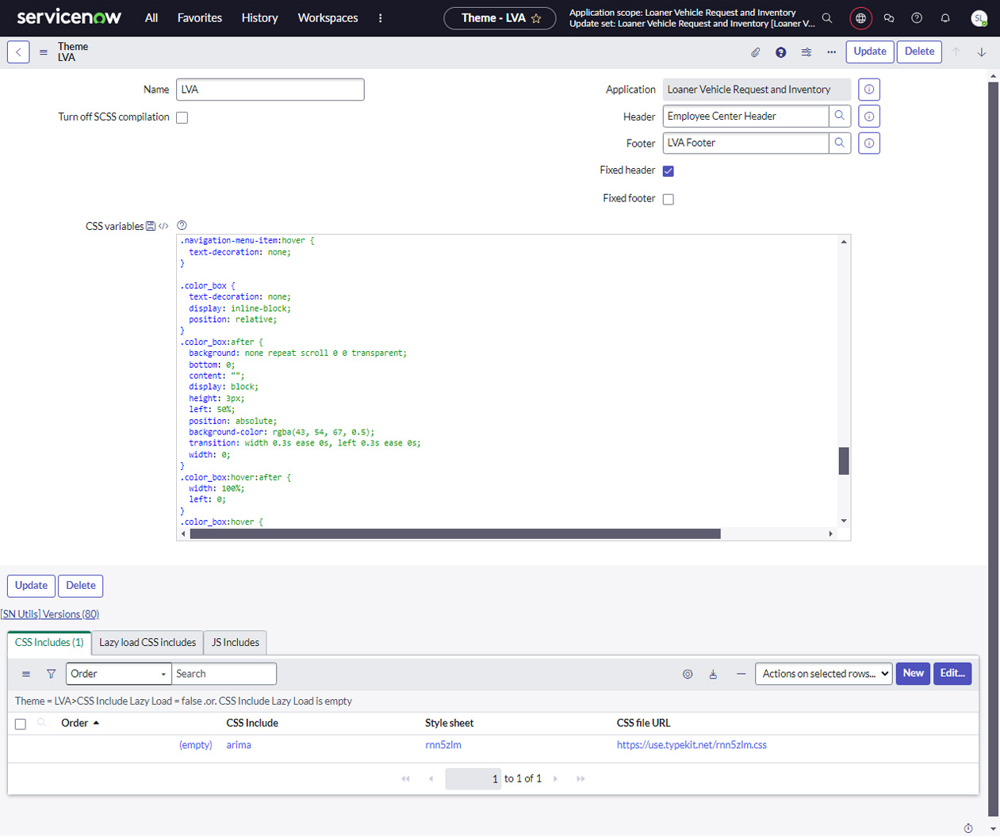
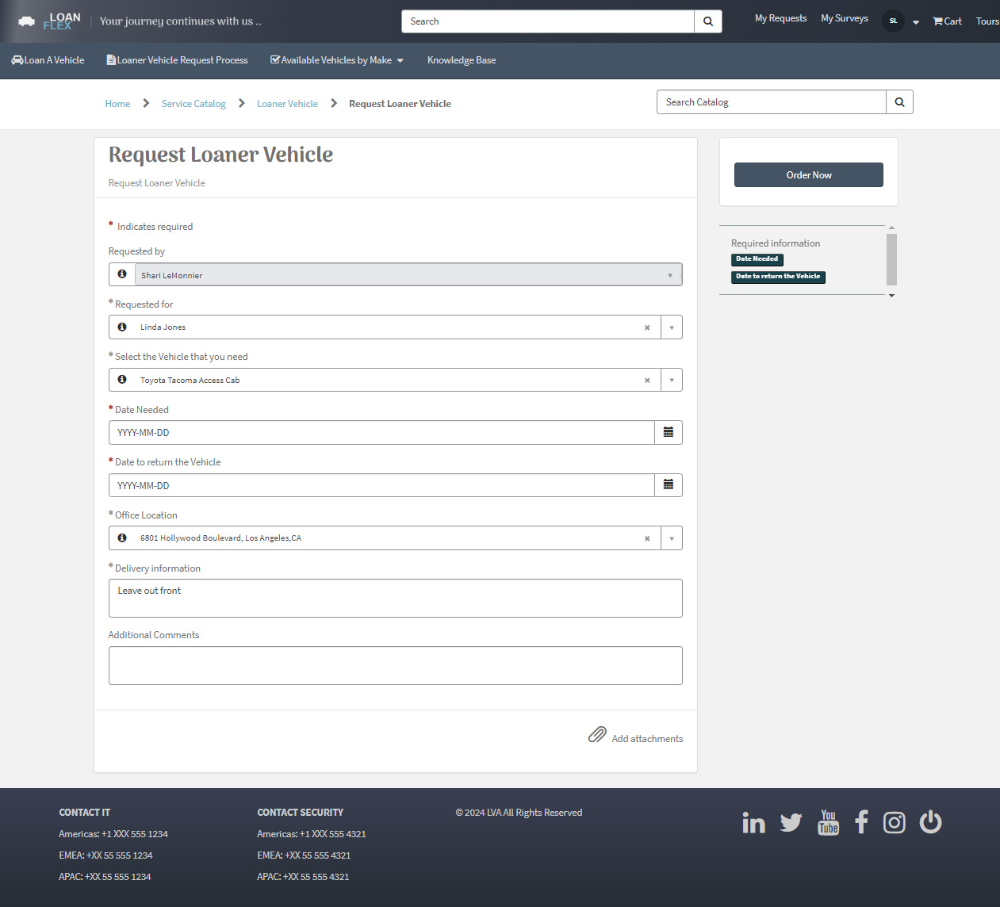
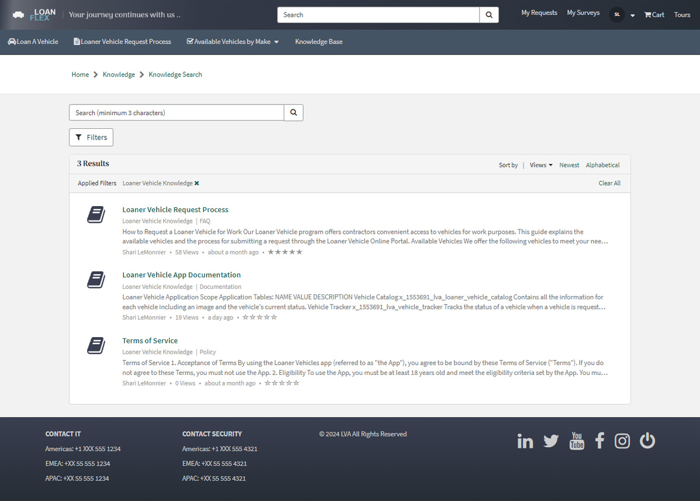
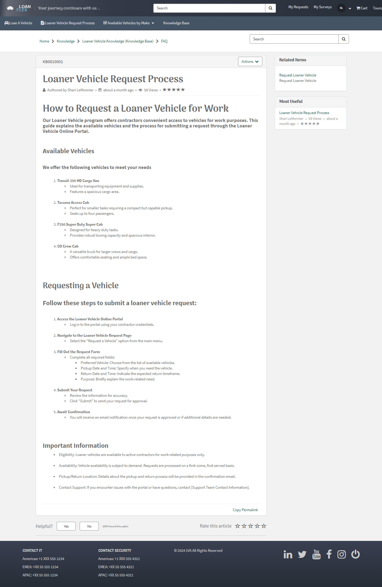
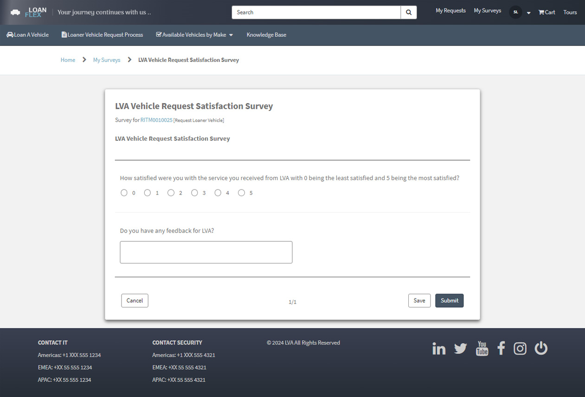
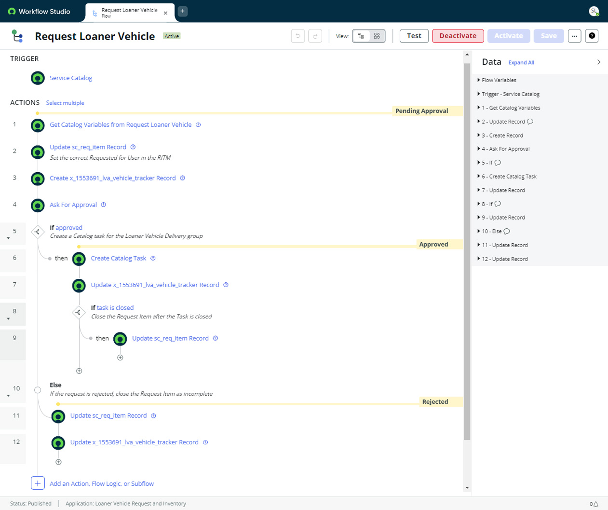
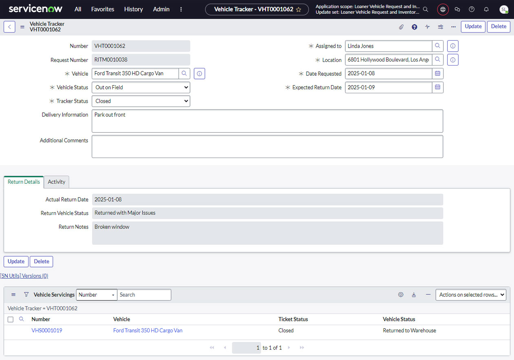
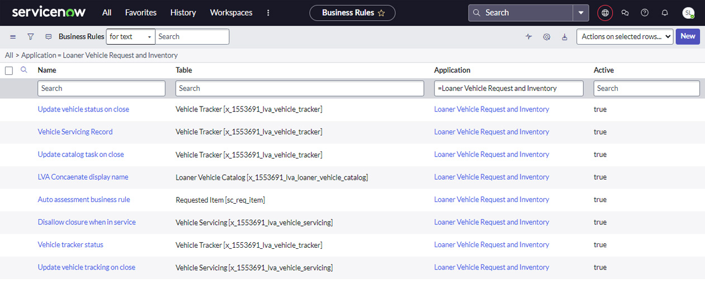
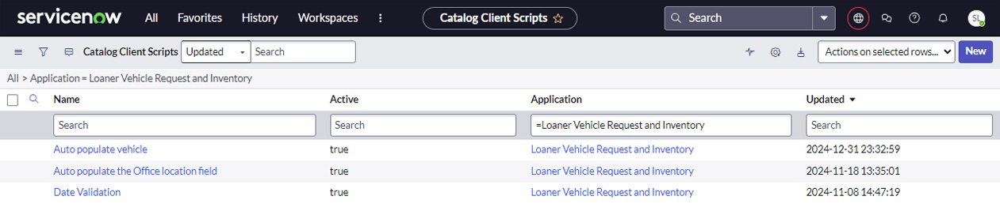

# Loaner Vehicle Application
## This custom ServiceNow application streamlines loaner vehicle management, offering a robust and efficient solution for managing loaner vehicles within your organization. 

 
<h2>Table of Contents</h2>

<h3><a href="#keyfeatures" title="Key Features">Key Features</a></h3>

<blockquote>  

<a href="#user-friendly-portal" title="User-Friendly Portal">★ User-Friendly Portal</a>  

<a href="#vehicle-catalog-&-availability" title="Vehicle Catalog & Availability">★ Vehicle Catalog & Availability</a>  

<a href="#automated-workflows" title="Automated Workflows">★ Automated Workflows</a>  

<a href="#status-tracking-&-notifications" title="Status Tracking & Notifications">★ Status Tracking & Notifications</a>  

<a href="#data-integrity-&-security" title="Data Integrity & Security">★ Data Integrity & Security</a>

</blockquote>

<h3><a href="#app-benefits" title="Benefits">Benefits</a></h3>
<blockquote>  
  
<a href="#improved-efficiency" title="Improved Efficiency">★ Improved Efficiency</a>

<a href="#enhanced-user-experience" title="Enhanced User Experience">★ Enhanced User Experience</a>

<a href="#increased-visibility" title="Increased Visibility">★ Increased Visibility</a>

<a href="#improved-data-accuracy" title="Improved Data Accuracy">★ Improved Data Accuracy</a>

</blockquote>
 

<a href="#custom-service-portal" title="Custom Service Portal">↓ Custom Service Portal</a>

<a href="#custom-theme-|-google-font" title="Custom Theme | Google Font">↓ Custom Theme | Google Font</a>

<a href="#request-a-loaner-vehicle---catalog-item" title="Request a Loaner Vehicle \- Catalog Item">↓ Request a Loaner Vehicle \- Catalog Item</a>

<a href="#custom-knowledge-base" title="Custom Knowledge Base">↓ Custom Knowledge Base</a>

<a href="#knowledge-article---how-to-request-a-loaner-vehicle-for-work" title="Knowledge Article \- How to Request a Loaner Vehicle for Work">↓ Knowledge Article \- How to Request a Loaner Vehicle for Work</a>

<a href="#satisfaction-survey" title="Satisfaction Survey">↓ Satisfaction Survey</a>

<a href="#process-flow---request-loaner-vehicle" title="Process Flow \- Request Loaner Vehicle">↓ Process Flow \- Request Loaner Vehicle</a>

<a href="#vehicle-tracker-record" title="Vehicle Tracker Record">↓ Vehicle Tracker Record</a>

<a href="#business-rules" title="Business Rules">↓ Business Rules</a>

<a href="#client-scripts" title="Client Scripts">↓ Client Scripts</a>

# 
 
 

<h2>Key Features</h2>

<h2 id="user-friendly-portal">User-Friendly Portal</h2>

- A custom-themed Service Portal with a unique look and feel, including a custom Knowledge Base and search functionality, provides a seamless user experience.

<h2 id="vehicle-catalog-&-availability">Vehicle Catalog & Availability</h2>

- An interactive "Availability Widget" displays real-time vehicle availability, allowing users to easily filter and select available vehicles.  
- A Service Catalog item simplifies the loan request process

<h2 id="automated-workflows">Automated Workflows</h2>

- Automates key processes like field population, date validation, and ticket creation for vehicle tracking and servicing.

<h2 id="status-tracking-&-notifications">Status Tracking & Notifications</h2>

- Tracks vehicle status throughout the loan lifecycle, ensuring transparency and accountability.  
- Sends automated email notifications to users at key stages.

<h2 id="data-integrity-&-security">Data Integrity & Security</h2>

- Enforces data integrity with features like required fields and status-dependent field visibility.
 
 

<h2>Benefits</h2>

<h2 id="improved-efficiency">Improved Efficiency</h2>

- Streamlines the loaner vehicle request and management process, saving time and resources.

<h2 id="enhanced-user-experience">Enhanced User Experience</h2>

- Provides a user-friendly interface that is easy to navigate and use.

<h2 id="increased-visibility">Increased Visibility</h2>

- Provides real-time insights into vehicle availability and utilization.

<h2 id="improved-data-accuracy">Improved Data Accuracy</h2>

- Ensures accurate and up-to-date information on all loaner vehicles.
 
 

<h1 id="custom-service-portal">Custom Service Portal</h1>

  
 
 
 

<h1 id="custom-theme-|-google-font">Custom Theme | Google Font</h1>

 
 
 

<h1 id="request-a-loaner-vehicle---catalog-item">Request a Loaner Vehicle \- Catalog Item</h1>

 
 
 

<h1 id="custom-knowledge-base">Custom Knowledge Base</h1>

 
 
 

<h1 id="knowledge-article---how-to-request-a-loaner-vehicle-for-work">Knowledge Article \- How to Request a Loaner Vehicle for Work</h1>

 
 
 

<h1 id="satisfaction-survey">Satisfaction Survey</h1>

 
 
 

<h1 id="process-flow---request-loaner-vehicle">Process Flow \- Request Loaner Vehicle</h1>

 
 
 

<h1 id="vehicle-tracker-record">Vehicle Tracker Record</h1>

 
 
 

<h1 id="business-rules">Business Rules</h1>

 
 
 

<h1 id="client-scripts">Client Scripts</h1>

 
 
 

