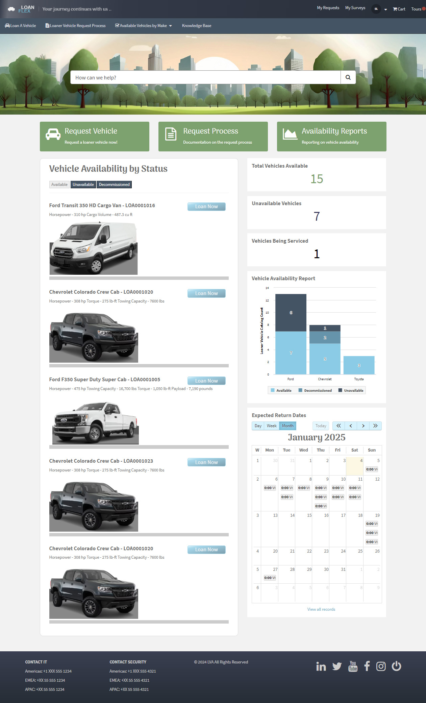

# Loaner Vehicle Application
## This custom ServiceNow application streamlines loaner vehicle management, offering a robust and efficient solution for managing loaner vehicles within your organization. 

 
<h2>Table of Contents</h2>

<h3><a href="#keyfeatures" title="Key Features">Key Features</a></h3>

<blockquote>  
  
[★ User-Friendly Portal](#user-friendly-portal)

[★ Vehicle Catalog & Availability](#vehicle-catalog-&-availability)

[★ Automated Workflows](#automated-workflows)

[★ Status Tracking & Notifications](#status-tracking-&-notifications)

[★ Data Integrity & Security](#data-integrity-&-security)

</blockquote>

<h3><a href="#app-benefits" title="Benefits">Benefits</a></h3>
<blockquote>  
  
[★ Improved Efficiency](#improved-efficiency)

[★ Enhanced User Experience](#enhanced-user-experience)

[★ Increased Visibility](#increased-visibility)

[★ Improved Data Accuracy](#improved-data-accuracy)

</blockquote>
 

[↓ Custom Service Portal](#custom-service-portal)

[↓ Custom Theme | Google Font](#custom-theme-|-google-font)

[↓ Request a Loaner Vehicle \- Catalog Item](#request-a-loaner-vehicle---catalog-item)

[↓ Custom Knowledge Base](#custom-knowledge-base)

[↓ Knowledge Article \- How to Request a Loaner Vehicle for Work](#knowledge-article---how-to-request-a-loaner-vehicle-for-work)

[↓ Satisfaction Survey](#satisfaction-survey)

[↓ Process Flow \- Request Loaner Vehicle](#process-flow---request-loaner-vehicle)

# 
 
 

<h2>Key Features</h2>

* ### User-Friendly Portal {#user-friendly-portal}

- A custom-themed Service Portal with a unique look and feel, including a custom Knowledge Base and search functionality, provides a seamless user experience.

* ### Vehicle Catalog & Availability {#vehicle-catalog-&-availability}

- An interactive "Availability Widget" displays real-time vehicle availability, allowing users to easily filter and select available vehicles.  
- A Service Catalog item simplifies the loan request process

* ### Automated Workflows {#automated-workflows}

- Automates key processes like field population, date validation, and ticket creation for vehicle tracking and servicing.

* ### Status Tracking & Notifications {#status-tracking-&-notifications}

- Tracks vehicle status throughout the loan lifecycle, ensuring transparency and accountability.  
- Sends automated email notifications to users at key stages.

* ### Data Integrity & Security {#data-integrity-&-security}

- Enforces data integrity with features like required fields and status-dependent field visibility.
 
 

<h2>Benefits</h2>

* ### Improved Efficiency {#improved-efficiency}

- Streamlines the loaner vehicle request and management process, saving time and resources.

* ### Enhanced User Experience {#enhanced-user-experience}

- Provides a user-friendly interface that is easy to navigate and use.

* ### Increased Visibility {#increased-visibility}

- Provides real-time insights into vehicle availability and utilization.

* ### Improved Data Accuracy {#improved-data-accuracy}

- Ensures accurate and up-to-date information on all loaner vehicles.
 
 

# Custom Service Portal {#custom-service-portal}

  
 
 
 

# Custom Theme | Google Font {#custom-theme-|-google-font}

 
 
 

# Request a Loaner Vehicle \- Catalog Item {#request-a-loaner-vehicle---catalog-item}

 
 
 

# Custom Knowledge Base {#custom-knowledge-base}  

 
 
 

# Knowledge Article \- How to Request a Loaner Vehicle for Work {#knowledge-article---how-to-request-a-loaner-vehicle-for-work}

 
 
 

# Satisfaction Survey {#satisfaction-survey}

 
 
 

# Process Flow \- Request Loaner Vehicle {#process-flow---request-loaner-vehicle}

 
 
 

# Vehicle Tracker Record {#vehicle-tracker-record}

 
 
 

# Business Rules {#business-rules}

 
 
 

# Client Scripts {#client-scripts}

 
 
 

